# Table of Contents

-   [Introduction](#org04a69de)
-   [1. Preparation for assembly](#orgeb5d76e)
    -   [1.1. Preparation of parts and tools](#org424bb42)
        -   [1.1.1 What’s in the box](#org0447f51)
        -   [1.1.2. Parts and tools necessary for building](#org469684a)
    -   [1.2. Check the PCB](#orgad05e82)
        -   [1.2.1. Preparation of Vial](#org4eddf84)
        -   [1.2.2. Flashing firmware](#orgbf37586)
        -   [1.2.3. Start Vial](#org187050a)
-   [2. Building](#org2937b0a)
    -   [2.1. Select layout](#org676ff62)
        -   [2.1.1. Install stabilizers](#org91d8c40)
        -   [2.1.2. Install rotary encoders](#orgdd27b0c)
    -   [2.2. Install plate](#org7550218)
    -   [2.3. Install PCB](#org455d358)
    -   [2.4. Install daughterboard](#orgf392d9c)
    -   [2.5. Test keyboard](#org34f2ee0)
    -   [2.6. Close the case](#org73b2324)
    -   [2.7. Install keycaps](#orgd9194c9)
-   [3. Keymap settings](#orgca9cc7e)
-   [4. Maintenance](#orgff9bf6d)
    -   [4.1. Firmware updates](#org2c9e474)
-   [5. Troubleshooting](#orgae41c66)
    -   [5.1. Keyboard is not recognized by PC](#org7a8ca22)
    -   [5.2. Some keys are unresponsive](#org36d7c8c)
    -   [5.3. Rotary encoder is unresponsive](#org537532f)
-   [6. Contact](#org15c74c3)
-   [Finally](#org7a69f99)

# Introduction

Thank you for your purchase!

It is not difficult to build, but please read this manual carefully and build it.
Hope you enjoy the Yak40!

# 1. Preparation for assembly

## 1.1. Preparation of parts and tools

### 1.1.1 What’s in the box

If there are any missing parts, please contact me at [6. Contact](#org15c74c3).

<table border="2" cellspacing="0" cellpadding="6" rules="groups" frame="hsides">

<colgroup>
<col  class="org-left" />

<col  class="org-right" />

<col  class="org-left" />

<col  class="org-left" />
</colgroup>
<thead>
<tr>
<th scope="col" class="org-left">Name</th>
<th scope="col" class="org-right">Quantity</th>
<th scope="col" class="org-left">Image</th>
<th scope="col" class="org-left">Description</th>
</tr>
</thead>

<tbody>
<tr>
<td class="org-left">Case</td>
<td class="org-right">1</td>
<td class="org-left">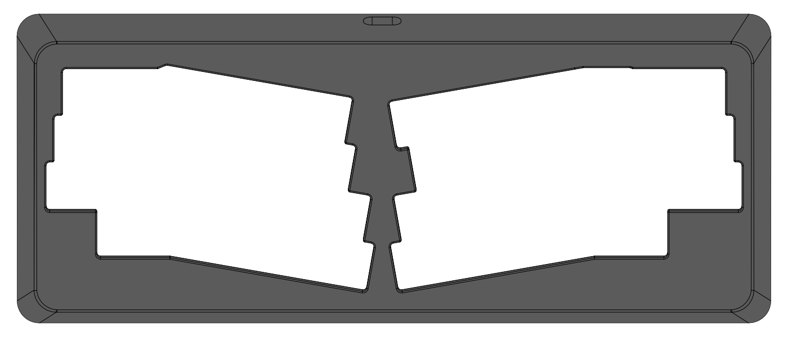</td>
<td class="org-left">CNC machined aluminum case.</td>
</tr>

<tr>
<td class="org-left">Bottom plate</td>
<td class="org-right">1</td>
<td class="org-left">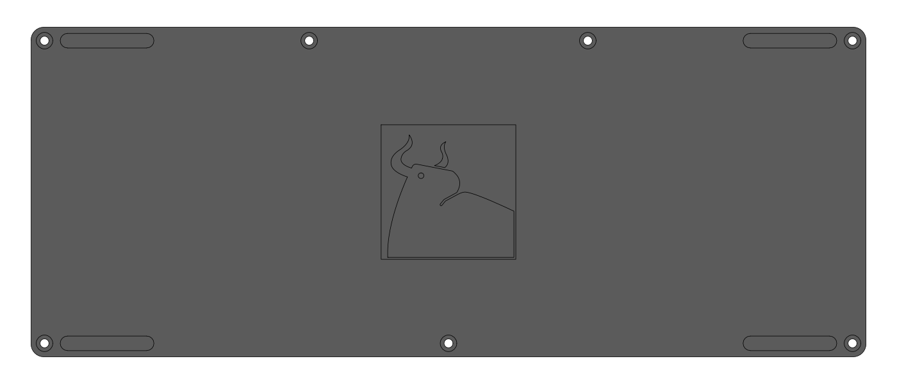</td>
<td class="org-left">Bottom plate of case.</td>
</tr>

<tr>
<td class="org-left">PCB</td>
<td class="org-right">1</td>
<td class="org-left"></td>
<td class="org-left">Mainboard of the Yak40. Basic components required to use are pre-soldered. The thickness is 1.6 mm.</td>
</tr>

<tr>
<td class="org-left">Daughterboard</td>
<td class="org-right">1</td>
<td class="org-left">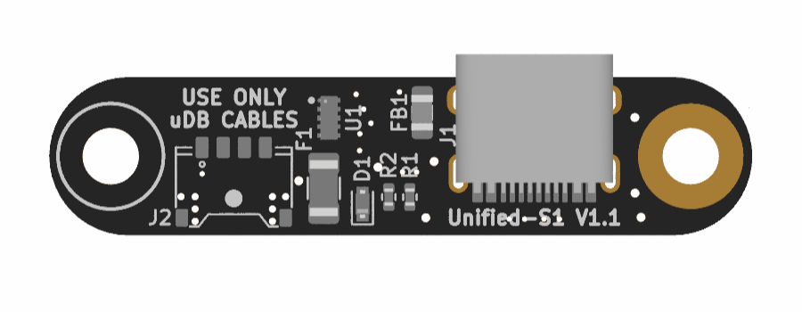</td>
<td class="org-left">USB daughterboards.</td>
</tr>

<tr>
<td class="org-left">Daughterboard cable</td>
<td class="org-right">1</td>
<td class="org-left"></td>
<td class="org-left">Cable to connect the daughterboard to the mainboard.</td>
</tr>

<tr>
<td class="org-left">Switch plate</td>
<td class="org-right">1</td>
<td class="org-left"></td>
<td class="org-left">Plate for mounting switches.</td>
</tr>

<tr>
<td class="org-left">Foam</td>
<td class="org-right">1</td>
<td class="org-left"></td>
<td class="org-left">4mm thick PORON foam to be placed between the plate and the PCB. Remove carefully as it is difficult to remove from the bag.</td>
</tr>

<tr>
<td class="org-left">Silicone O-ring</td>
<td class="org-right">20(including 4 spare)</td>
<td class="org-left"></td>
<td class="org-left">O-ring for burger mount.</td>
</tr>

<tr>
<td class="org-left">M2x3.5 Standoffs</td>
<td class="org-right">9(including 2 spare)</td>
<td class="org-left"></td>
<td class="org-left">4mm diameter standoffs for connecting the plate to the PCB.</td>
</tr>

<tr>
<td class="org-left">M2x3 Low head screws</td>
<td class="org-right">16(including 2 spare)</td>
<td class="org-left"></td>
<td class="org-left">Screws for connecting the plate to the PCB.</td>
</tr>

<tr>
<td class="org-left">M2x5 Truss head screws</td>
<td class="org-right">10(including 2 spare)</td>
<td class="org-left"></td>
<td class="org-left">Screws for installing the plate in the case.</td>
</tr>

<tr>
<td class="org-left">M3x6 Low head screws</td>
<td class="org-right">3(including 1 spare)</td>
<td class="org-left">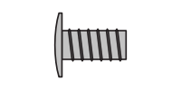</td>
<td class="org-left">Screws for installing the daughterboard to the case.</td>
</tr>

<tr>
<td class="org-left">M3x4 Pan head screw</td>
<td class="org-right">8(including 1 spare)</td>
<td class="org-left"></td>
<td class="org-left">Screws for mounting the bottom plate to the case.</td>
</tr>

<tr>
<td class="org-left">Rubber feet</td>
<td class="org-right">8(including 4 spare)</td>
<td class="org-left"></td>
<td class="org-left">Rubber feet to be attached to bottom plate.</td>
</tr>

<tr>
<td class="org-left">Screwdriver</td>
<td class="org-right">1</td>
<td class="org-left">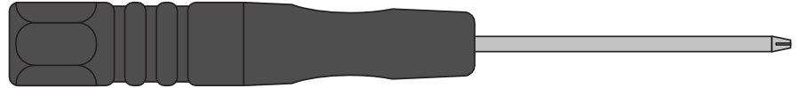</td>
<td class="org-left">Used to tighten screws.</td>
</tr>
</tbody>
</table>

### 1.1.2. Parts and tools necessary for building

<table border="2" cellspacing="0" cellpadding="6" rules="groups" frame="hsides">

<colgroup>
<col  class="org-left" />

<col  class="org-left" />

<col  class="org-left" />
</colgroup>
<thead>
<tr>
<th scope="col" class="org-left">Name</th>
<th scope="col" class="org-left">Quantity</th>
<th scope="col" class="org-left">Description</th>
</tr>
</thead>

<tbody>
<tr>
<td class="org-left">MX compatible keyswitches</td>
<td class="org-left">41 to 46</td>
<td class="org-left">Please prepare your favorite one.</td>
</tr>

<tr>
<td class="org-left">PCB mounting stabilizers 2U</td>
<td class="org-left">0 to 3</td>
<td class="org-left">Please use the one corresponding to PCB thickness of 1.6mm.</td>
</tr>

<tr>
<td class="org-left">EC12 compatible rotary encoder</td>
<td class="org-left">0 to 2</td>
<td class="org-left">Soldering is required to install the rotary encoder.</td>
</tr>

<tr>
<td class="org-left">MX compatible keycaps</td>
<td class="org-left">1 set</td>
<td class="org-left">Because of the mixed south and north orientation of the keyswitches depending on the layout selected, some keycaps may interfere with the keyswitches.</td>
</tr>

<tr>
<td class="org-left">USB Type-C cable</td>
<td class="org-left">1</td>
<td class="org-left">Depending on the shape of the connector part, it may not be usable due to interference with the case.</td>
</tr>

<tr>
<td class="org-left">Soldering iron</td>
<td class="org-left">1</td>
<td class="org-left">If you wish to install a rotary encoder, please prepare it.</td>
</tr>

<tr>
<td class="org-left">Thread solder</td>
<td class="org-left">As needed</td>
<td class="org-left">If you wish to install a rotary encoder, please prepare it.</td>
</tr>
</tbody>
</table>

## 1.2. Check the PCB

### 1.2.1. Preparation of Vial

Use Vial( <https://get.vial.today> ) to manage the keymap.  
Please install the application or prepare a compatible browser.

### 1.2.2. Flashing firmware

1.  Download the Yak40 firmware from the following URL.
    -   <https://github.com/kuriki-sasa/vial-qmk/releases>  
        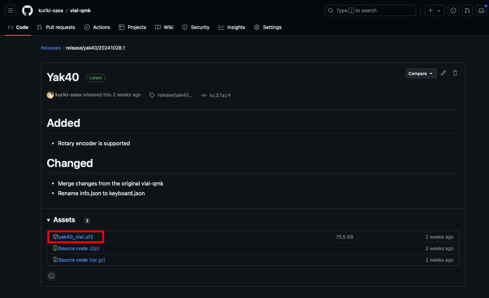
2.  Connect the PCB and the daughterboard with the daughterboard cable.
3.  Connect PC and the daughterboard with a USB Type-C cable.
    -   Mounted as USB storage on PC after connection.
4.  Copy downloaded firmware to USB storage.
    -   When copying is complete, the USB storage device is automatically ejected and recognized as a keyboard.

### 1.2.3. Start Vial

Launch the web or application of Vial and make sure the keyboard is recognized.  
If the keyboard is not recognized, please refer to [5. Troubleshooting](#orgae41c66).

If all is well, remove it from the PC and disassemble it into the PCB, daughterboard, and daughterboard cable.

# 2. Building

## 2.1. Select layout

Select the layout you want to use from [the supported layout](https://www.keyboard-layout-editor.com/#/gists/28697eab129d40e1805bf8ff4fb0f721) at this point, as it is not possible to install stabilizers or rotary encoders after assembly.  
If you do not wish to install stabilizers or rotary encoders, skip this section.

### 2.1.1. Install stabilizers

Install stabilizers in the following positions depending on the layout you want to use.  

### 2.1.2. Install rotary encoders

Solder the rotary encoder in the following positions depending on the layout you want to use.  
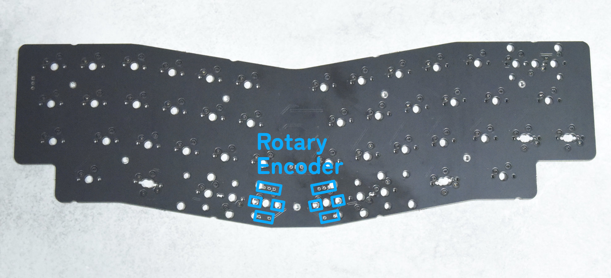

## 2.2. Install plate

1.  Attach the stadoffs with `M2x3 Low head screws`, paying attention to the front and back of the plate.  
    
2.  Place the O-ring on the red circle position on the case.  
    
3.  Put the plate on the case.
    -   Please place the O-ring carefully as it can easily be displaced.
4.  `M2x5 Truss head screws` through the O-ring and install the switch plate in the case.  
    
    
    -   If the screw is tightened too strongly, the key feel will become hard. Tighten the screws with moderate force.

## 2.3. Install PCB

1.  Place PORON foam on the plate.  
    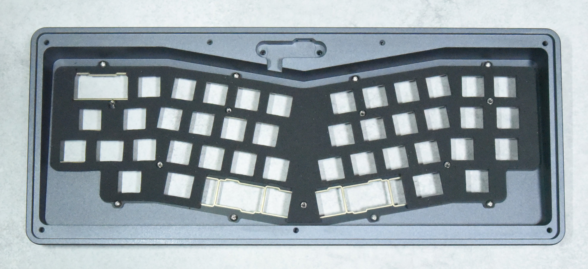
    -   Since it is difficult to remove the foam from the bag, do not pull it by force, but take it out carefully.
2.  Mount the PCB on the plate with `M2x3 Low head screws`.  
    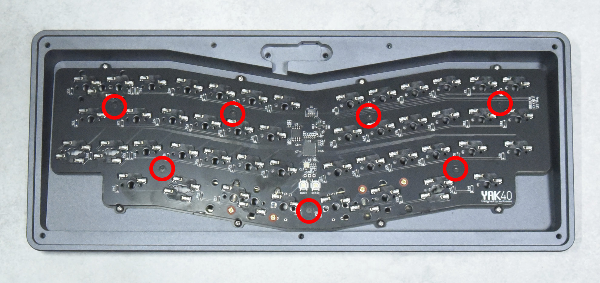
    -   The foam is slightly thicker than the height of the spacer.  
        Tighten the screws while pushing the PCB toward the switch plate with your fingers.

## 2.4. Install daughterboard

1.  Install the daughterboard in the case with `M3x6 low head screws`.  
    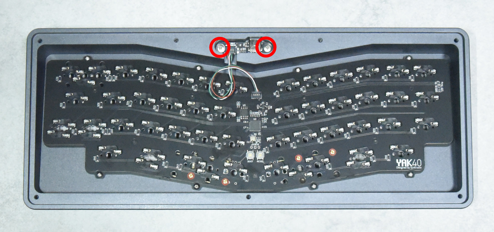
2.  Connect the PCB and the daughterboard with the daughterboard cable.

## 2.5. Test keyboard

1.  Turn the case over and install the keyswitches.  
    
2.  Connect the Yak40 to the PC with a USB Type-C cable.
3.  Launch the web or application of Vial.
4.  Display the `Layout` tab and select a layout.  
    
5.  Display the `Matrix tester` tab and click the `Unlock`.  
    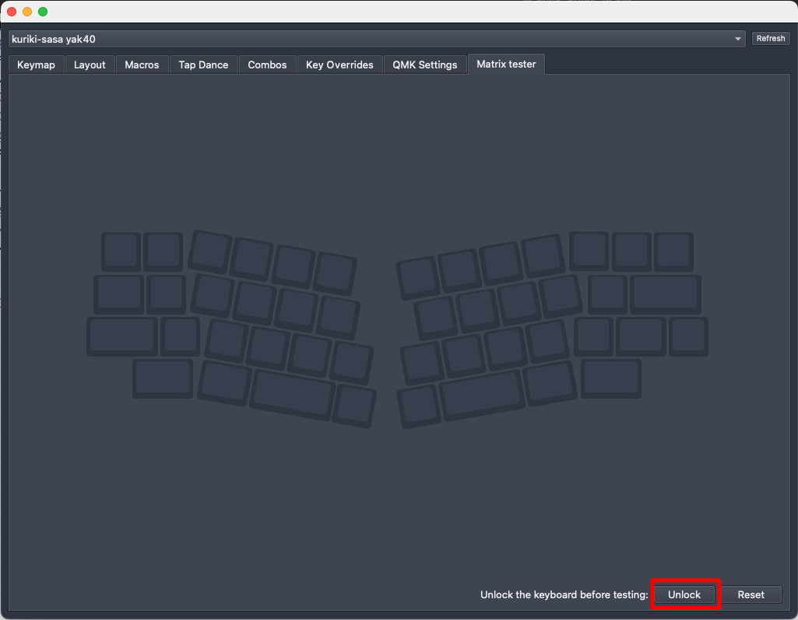
6.  Press and hold the two keys indicated.  
    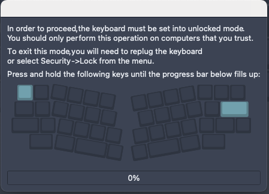
    -   If the progress bar does not advance even though the key is pressed, please check [5. Troubleshooting](#orgae41c66).
7.  Make sure all keys are responsive.  
    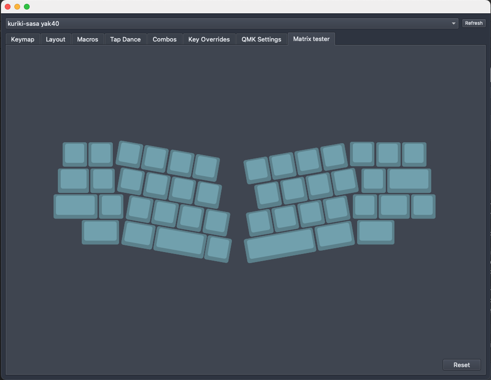
    -   If some keys do not respond, please check [5. Troubleshooting](#orgae41c66).

## 2.6. Close the case

1.  Attach the bottom plate to the case with `M3x4 Pan head screws`.
2.  Attach the rubber feet to the bottom plate to match the recesses in the bottom plate.  
    

## 2.7. Install keycaps

Install your favorite keycap you have prepared.  
It is almost finished!

# 3. Keymap settings

Display the `Keymap` tab and set your preferred keymap.

Click on the key you wish to change from the top of the screen, then select the key you wish to set from the bottom of the screen.  
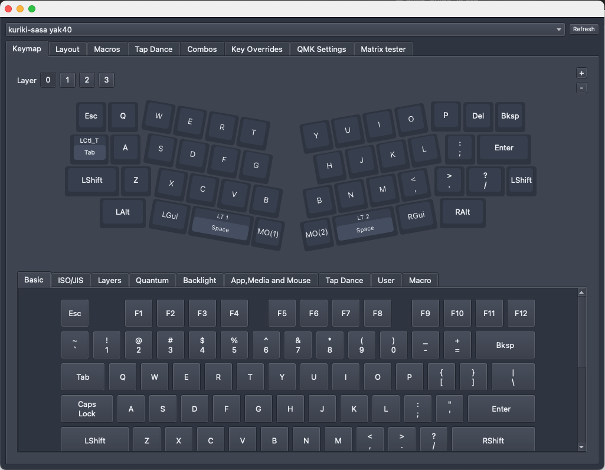

# 4. Maintenance

## 4.1. Firmware updates

1.  Remove the bottom plate from the case.
2.  Connect the Yak40 to the PC with a USB Type-C cable.
3.  Press the `RESET` switch while holding down the `BOOT` switch on the PCB.  
    
    -   Mounted as USB storage on PC.
4.  Copy the new firmware to USB storage.
    -   When copying is complete, the USB storage device is automatically ejected and recognized as a keyboard.
5.  Attach the bottom plate to the case.

# 5. Troubleshooting

## 5.1. Keyboard is not recognized by PC

Try the following steps in order.

1.  Check the daughterboard and the PCB connections.
    -   Make sure that the connectors are inserted deep into the sockets on both the daughterboard and the PCB.
2.  Check that the USB Type-C cable is inserted all the way to the back.
    -   Depending on the shape of the connector part, there is a possibility of interference with the case.  
        Try connecting with another USB Type-C cable.
3.  Please contact me at [6. Contact](#org15c74c3).
    -   Please contact me through one of the contacts.  
        I would appreciate it if you could also attach detailed symptoms and photos.

## 5.2. Some keys are unresponsive

Try the following steps in order.

1.  Remove the keyswitch on the unresponsive key.
2.  Ensure that the legs of the keyswitch are not bent.
    -   If the legs are bent, replace them with new keyswitches or straighten the legs before reinstalling them.
3.  Check that the keyswitch is inserted correctly.
    -   Insert the keyswitch all the way to the back so that it does not float off the switch plate.
4.  Please contact me at [6. Contact](#org15c74c3).
    -   Please contact me through one of the contacts.  
        I would appreciate it if you could also attach detailed symptoms and photos.

## 5.3. Rotary encoder is unresponsive

Try the following steps in order.

1.  Check that the soldering is done correctly.
    -   The soldering pad is small for coexistence with the key socket.  
        Heat the pad with a soldering iron again and confirm that it is soldered.
2.  Please contact me at [6. Contact](#org15c74c3).
    -   Please contact me through one of the contacts.  
        I would appreciate it if you could also attach detailed symptoms and photos.

# 6. Contact

-   X(Twitter): [@kurikisasa](https://x.com/kuriki_sasa)
-   Bluesky: [@kurikisasa.bsky.social](https://bsky.app/profile/kurikisasa.bsky.social)
-   Discord: kurikisasa
-   Discord server: <https://discord.gg/pC4t9NJStE>

# Finally

Did you complete it successfully?

All Yak40 design data is available at [GitHub](https://github.com/kuriki-sasa/Yak40).  
You can manufacture your own, or create your own original with reference to it, or use it as you like within the scope of the license.

Have a good keyboard life!

