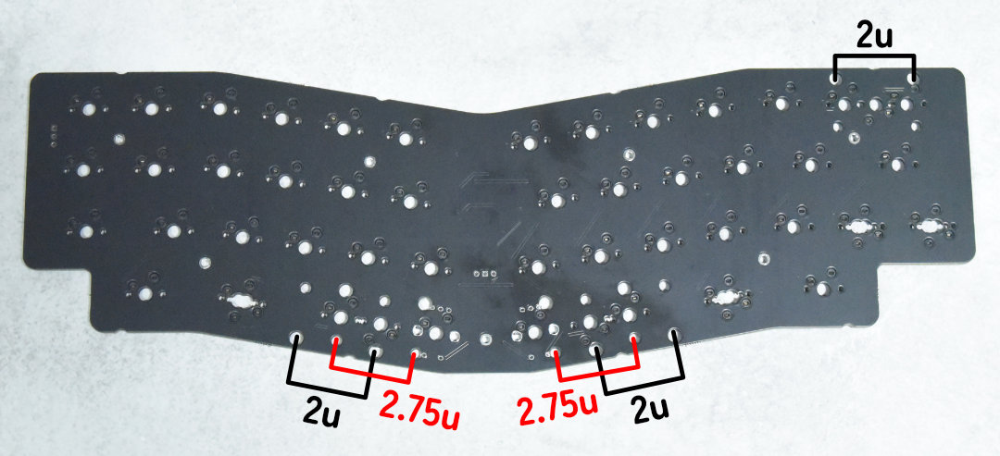
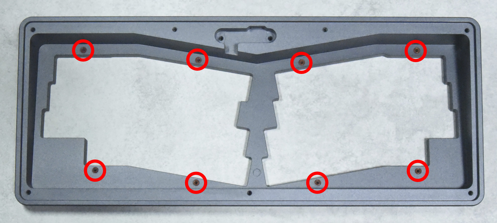
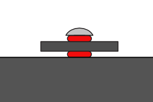

# Table of Contents

-   [はじめに](#orgbf53173)
-   [1. 準備](#orgf3e5f9e)
    -   [1.1. パーツ・工具の確認](#orgdb952ee)
        -   [1.1.1 キットに含まれるパーツ・工具](#orgb7a3504)
        -   [1.1.2. ご自身でご用意いただくパーツ・工具](#org203b45a)
    -   [1.2. PCBの動作確認](#org0627959)
        -   [1.2.1. Vial環境の準備](#org6ec5758)
        -   [1.2.2. ファームウェア書き込み](#org5142926)
        -   [1.2.3. Vialを起動](#orgcd50286)
-   [2. 組み立て](#org8721d88)
    -   [2.1. レイアウトの選択](#org1f59504)
        -   [2.1.1. スタビライザーの取り付け](#orgd07e1e6)
        -   [2.1.2. ロータリーエンコーダーの取り付け](#org6615693)
    -   [2.2. スイッチプレート取り付け](#orgaa5ed1b)
    -   [2.3. PCB取り付け](#org1a398cc)
    -   [2.4. ドーターボード取り付け](#orgf2a9385)
    -   [2.5. 動作確認](#orgf91c271)
    -   [2.6. キーキャップ取り付け](#org66cc0f8)
-   [3. キーマップの設定](#org3d28146)
-   [4. メンテナンス](#orgfd082f0)
    -   [4.1. ファームウェア更新](#org94486aa)
-   [5. トラブルシューティング](#orgcc7caf2)
    -   [5.1. キーボードがPCに認識されない](#orgaf20b1c)
    -   [5.2. キースイッチが反応しない](#org1df49ef)
    -   [5.3. ロータリーエンコーダーが反応しない](#org3be3872)
-   [6. 連絡先](#org7f4450a)
-   [さいごに](#orgcaaa364)

# はじめに

Yak40をお買い上げいただきありがとうございます。  
決して難しい構造ではありませんが、このドキュメントを良く読んで組み立ててください。  
Yak40によって、あなたのキーボードライフが少しでも楽しいものになればこれに勝る喜びはありません。

# 1. 準備

## 1.1. パーツ・工具の確認

### 1.1.1 キットに含まれるパーツ・工具

キットには以下のパーツ・工具が含まれています。  
不足がある場合は[6. 連絡先](#org7f4450a)までご連絡ください。

<table border="2" cellspacing="0" cellpadding="6" rules="groups" frame="hsides">

<colgroup>
<col  class="org-left" />

<col  class="org-right" />

<col  class="org-left" />

<col  class="org-left" />
</colgroup>
<thead>
<tr>
<th scope="col" class="org-left">名称</th>
<th scope="col" class="org-right">数量</th>
<th scope="col" class="org-left">画像</th>
<th scope="col" class="org-left">説明</th>
</tr>
</thead>

<tbody>
<tr>
<td class="org-left">ケース</td>
<td class="org-right">1</td>
<td class="org-left"></td>
<td class="org-left">CNC切削アルミケース。</td>
</tr>

<tr>
<td class="org-left">ボトムプレート</td>
<td class="org-right">1</td>
<td class="org-left"></td>
<td class="org-left">ケースの底板。</td>
</tr>

<tr>
<td class="org-left">PCB</td>
<td class="org-right">1</td>
<td class="org-left"></td>
<td class="org-left">キーボードの本体となる基板。パーツはすべて実装済みです。</td>
</tr>

<tr>
<td class="org-left">ドーターボード</td>
<td class="org-right">1</td>
<td class="org-left"></td>
<td class="org-left">USBコネクター部分の基板。</td>
</tr>

<tr>
<td class="org-left">ドーターボードケーブル</td>
<td class="org-right">1</td>
<td class="org-left"></td>
<td class="org-left">PCBとドータボードを接続するためのケーブル。</td>
</tr>

<tr>
<td class="org-left">スイッチプレート</td>
<td class="org-right">1</td>
<td class="org-left"></td>
<td class="org-left">キースイッチを固定するためのプレート。</td>
</tr>

<tr>
<td class="org-left">ミドルフォーム</td>
<td class="org-right">1</td>
<td class="org-left"></td>
<td class="org-left">スイッチプレートとPCBの間に挟む4mm厚のPORONフォーム。袋から取り出しづらいため、慎重に取り出してください。</td>
</tr>

<tr>
<td class="org-left">バーガーマウント用Oリング</td>
<td class="org-right">20(予備4)</td>
<td class="org-left"></td>
<td class="org-left">バーガーマウント用のシリコンOリング。</td>
</tr>

<tr>
<td class="org-left">M2x3.5 スペーサー</td>
<td class="org-right">9(予備2)</td>
<td class="org-left"></td>
<td class="org-left">スイッチプレートとPCBを固定するための4mm径のスペーサ。</td>
</tr>

<tr>
<td class="org-left">M2x3 低頭ねじ</td>
<td class="org-right">16(予備2)</td>
<td class="org-left"></td>
<td class="org-left">スイッチプレートにPCBを取り付けるためのねじ。</td>
</tr>

<tr>
<td class="org-left">M2x5 トラスねじ</td>
<td class="org-right">10(予備2)</td>
<td class="org-left"></td>
<td class="org-left">ケースにスイッチプレートを取り付けるためのねじ。</td>
</tr>

<tr>
<td class="org-left">M3x6 低頭ねじ</td>
<td class="org-right">2(予備1)</td>
<td class="org-left"></td>
<td class="org-left">ドーターボードをケースに取り付けるためのねじ。</td>
</tr>

<tr>
<td class="org-left">M3x4 なべねじ</td>
<td class="org-right">8(予備1)</td>
<td class="org-left"></td>
<td class="org-left">ケースにボトムプレートを取り付けるためのねじ。</td>
</tr>

<tr>
<td class="org-left">ゴム足</td>
<td class="org-right">8(予備4)</td>
<td class="org-left"></td>
<td class="org-left">ボトムプレートに貼り付ける滑り止め。</td>
</tr>

<tr>
<td class="org-left">+ドライバー</td>
<td class="org-right">1</td>
<td class="org-left"></td>
<td class="org-left">ねじを締め付けるために使用します。</td>
</tr>
</tbody>
</table>

### 1.1.2. ご自身でご用意いただくパーツ・工具

キット以外に以下のパーツが必要になります。  
ご自身でお気に入りのものをご用意ください。

<table border="2" cellspacing="0" cellpadding="6" rules="groups" frame="hsides">

<colgroup>
<col  class="org-left" />

<col  class="org-left" />

<col  class="org-left" />
</colgroup>
<thead>
<tr>
<th scope="col" class="org-left">名称</th>
<th scope="col" class="org-left">数量</th>
<th scope="col" class="org-left">説明</th>
</tr>
</thead>

<tbody>
<tr>
<td class="org-left">MX(互換)キースイッチ</td>
<td class="org-left">41から46</td>
<td class="org-left">選択したレイアウトに応じて必要な個数をご用意ください。</td>
</tr>

<tr>
<td class="org-left">PCBマウント MX(互換)スタビライザー 2U</td>
<td class="org-left">0から3</td>
<td class="org-left">選択したレイアウトに応じてお好みでご用意ください。</td>
</tr>

<tr>
<td class="org-left">EC12(互換)ロータリーエンコーダー</td>
<td class="org-left">0から2</td>
<td class="org-left">選択したレイアウトに応じて必要な個数をご用意ください。ロータリーエンコーダーを取り付ける場合ははんだ付けが必要になります。</td>
</tr>

<tr>
<td class="org-left">MX(互換)キーキャップ</td>
<td class="org-left">1セット</td>
<td class="org-left">お好きなものをご用意ください。ただし、選択したレイアウトに応じてキースイッチの南向き、北向きが混在するため、キーキャップによってキースイッチと干渉する可能性があります。</td>
</tr>

<tr>
<td class="org-left">USB Type-Cケーブル</td>
<td class="org-left">1</td>
<td class="org-left">お好きなものをご用意ください。ただし、コネクター部分の形状によっては奥まで挿し込めない可能性があります。</td>
</tr>

<tr>
<td class="org-left">はんだごて</td>
<td class="org-left">一式</td>
<td class="org-left">ロータリーエンコーダーを取り付けたい場合はご用意ください。一般的な電子工作用のはんだごてで十分です。</td>
</tr>

<tr>
<td class="org-left">はんだ</td>
<td class="org-left">適量</td>
<td class="org-left">ロータリーエンコーダーを取り付けたい場合はご用意ください。</td>
</tr>
</tbody>
</table>

## 1.2. PCBの動作確認

### 1.2.1. Vial環境の準備

キーマップの変更にはVial( <https://get.vial.today> )を使用します。  
以下のいずれかの環境をご用意ください。

-   Web版（最新のChrome、Chromium、Edge推奨）
-   デスクトップアプリ版

### 1.2.2. ファームウェア書き込み

1.  以下のURLからYak40のファームウェアをダウンロードする
    -   <https://github.com/kuriki-sasa/vial-qmk/releases>  
        
2.  PCBとドーターボードをドーターボードケーブルで接続する
3.  USB Type-CケーブルでPCとドーターボードを接続する
    -   PCにUSBストレージとして認識されます。
4.  認識したUSBストレージにダウンロードしたファームウェアをコピーする
    -   コピーが完了すると自動でUSBストレージが取り出され、キーボードとして認識されます。

### 1.2.3. Vialを起動

Web版、またはデスクトップアプリ版Vialを起動し、キーボードが認識されていることを確認してください。  
認識しない場合はは[5. トラブルシューティング](#orgcc7caf2)をご確認ください。  
確認が完了したらPCから取り外し、PCB、ドーターボード、ドーターボードケーブルに分解します。

# 2. 組み立て

## 2.1. レイアウトの選択

組み立て後にスタビライザー、またはロータリーエンコーダーを取り付けることはできないため、この時点で[対応レイアウト](https://www.keyboard-layout-editor.com/#/gists/28697eab129d40e1805bf8ff4fb0f721)から使いたいレイアウトを選択します。  
スタビライザー、またはロータリーエンコーダーを取り付けない場合は組み立て後からもレイアウトを変更できるため、この項目はスキップしてください。

### 2.1.1. スタビライザーの取り付け

使いたいレイアウトに応じて以下の位置にスタビライザーを取り付けます。  

### 2.1.2. ロータリーエンコーダーの取り付け

使いたいレイアウトに応じて以下の位置にロータリーエンコーダーをはんだ付けします。  

## 2.2. スイッチプレート取り付け

1.  スイッチプレートの表裏に注意し、 `M2x3 低頭ねじ` でスペーサーを取り付ける  
    
2.  ケースの赤丸の位置にOリングを乗せる  
    
3.  ケースにスイッチプレートを乗せる
    -   Oリングがずれやすいため慎重に乗せてください。
4.  `M2x5 トラスねじ` にOリングを通し、ケースにスイッチプレートを取り付ける  
      
    
    -   ゆるすぎると使用中にスイッチプレートが外れ、逆に強く締めすぎると打鍵感が固くなります。  
        適度な力で締め付けてください。

## 2.3. PCB取り付け

1.  スイッチプレートにフォームを置く  
    
    -   袋から取り出しづらいため、無理に引っ張らず、慎重に取り出してください。
2.  スイッチプレートに `M2x3 低頭ねじ` でPCBを取り付ける  
    
    -   スペーサーの高さよりもフォームのほうが少し厚くなっています。  
        指でPCBをスイッチプレート側に押しながらねじを締めてください。

## 2.4. ドーターボード取り付け

1.  ケースに `M3x6 低頭ねじ` でドーターボードを取り付ける  
    
2.  PCBとドーターボードをドーターボードケーブルで接続する

## 2.5. 動作確認

1.  ケースを裏返し、キースイッチを取り付ける  
    
2.  USB Type-CケーブルでPCとYak40キーボードを接続する
3.  Web版、またはデスクトップアプリ版Vialを起動する
4.  `Layout` タブを表示し、レイアウトを選択する  
    
    -   ドロップダウンメニューからご自身のYak40のレイアウトを選択してください。
5.  `Matrix tester` タブを表示し、 `Unlock` ボタンをクリックする  
    
6.  表示された二箇所のキーを長押しする  
    
    -   キーを押しているのに進捗バーが進まない場合、キーが反応していない可能性があります。  
        [5. トラブルシューティング](#orgcc7caf2)をご確認ください。
7.  全キーが反応することを確認する  
    
    -   反応しないキーがある場合は[5. トラブルシューティング](#orgcc7caf2)をご確認ください。

## 2.6. キーキャップ取り付け

用意したお気に入りのキーキャップを取り付けてください。  
もう少しで完成です。

# 3. キーマップの設定

`Keymap` タブを表示し、お好みのキーマップを設定してください。  
画面上部から変更したいキーをクリックし、その後、設定したいキーを画面下部から選択します。  

# 4. メンテナンス

## 4.1. ファームウェア更新

1.  ボトムプレートを取り外す
2.  USB Type-CケーブルでPCとYak40キーボードを接続する
3.  PCBの `BOOT` スイッチを押しながら `RESET` スイッチを押す  
    
    -   PCにUSBストレージとして認識されます。
4.  認識したUSBストレージに新しいファームウェアをコピーする
    -   コピーが完了すると自動でUSBストレージが取り出され、キーボードとして認識されます。
5.  ボトムプレートを取り付ける

# 5. トラブルシューティング

## 5.1. キーボードがPCに認識されない

以下手順を順番に試してください。

1.  ドーターボードとPCBの接続を確認する
    -   ドーターボード・PCB両方のソケットの奥までコネクターが挿さっていることを確認してください。
2.  USB Type-Cケーブルが奥まで挿さっているか確認する
    -   コネクター部分の形状によってはケースと干渉する可能性があります。  
        他のUSB Type-Cケーブルでの接続もお試しください。
3.  [6. 連絡先](#org7f4450a)に連絡する
    -   お手数をおかけしますが、連絡先のいずれかから私に連絡をしてください。  
        その際詳しい症状・写真も添付していただけますとありがたいです。

## 5.2. キースイッチが反応しない

以下手順を順番に試してください。

1.  反応しないキーのスイッチを外す
2.  キースイッチの足が曲がっていないことを確認する
    -   足が曲がっていた場合は新しいキースイッチに交換するか、足を真っ直ぐに修正してから再度取り付けてください。
3.  キースイッチが正しく挿さっていることを確認する
    -   キースイッチがスイッチプレートから浮いている場合は、浮かないように奥まで挿してください。
4.  [6. 連絡先](#org7f4450a)に連絡する
    -   お手数をおかけしますが、連絡先のいずれかから私に連絡をしてください。  
        その際詳しい症状・写真も添付していただけますとありがたいです。

## 5.3. ロータリーエンコーダーが反応しない

以下手順を順番に試してください。

1.  正しくはんだ付けできていることを確認する
    -   キーソケットとの共存のため、はんだ付け部分(パッド)が小さくなっています。  
        再度はんだごてでパッドを熱し、はんだ付けできていることを確認してください。
2.  [6. 連絡先](#org7f4450a)に連絡する
    -   お手数をおかけしますが、連絡先のいずれかから私に連絡をしてください。  
        その際詳しい症状・写真も添付していただけますとありがたいです。

# 6. 連絡先

-   X(Twitter): [@kurikisasa](https://x.com/kuriki_sasa)
-   Bluesky: [@kurikisasa.bsky.social](https://bsky.app/profile/kurikisasa.bsky.social)
-   Discord: kurikisasa
-   Discord server: <https://discord.gg/pC4t9NJStE>

# さいごに

無事、完成できましたでしょうか？  
Yak40の設計データは全て[GitHub](https://github.com/kuriki-sasa/Yak40)で公開しています。  
自分で製造するもよし、参考にしてオリジナルを作るもよし、ライセンス範囲内でお好きにご活用ください。  
良きキーボードライフを！

